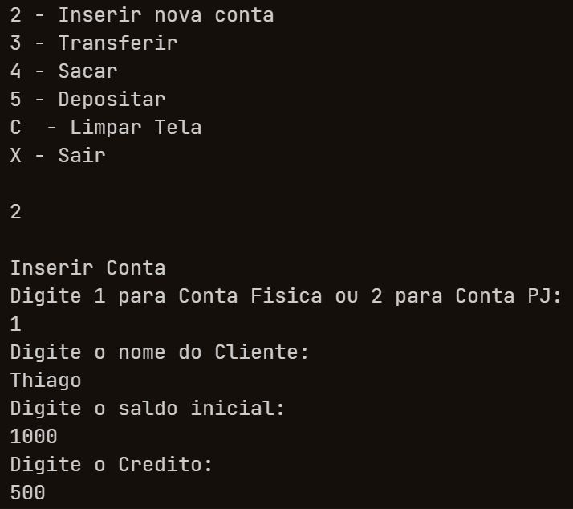
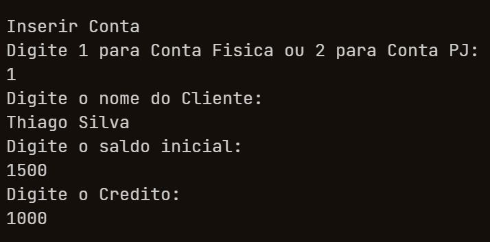

### Requisitos tenha dotnet core instalado

### PARA EXECUTAR USE O COMANDO DOTNET RUN no terminal da pasta da aplicação

## menu

## Inserir Conta 0 

## Inserir Conta 1 

## Listar Contas 

## Transferir Valor

## Sacar Valor

## Depositar Valor

1